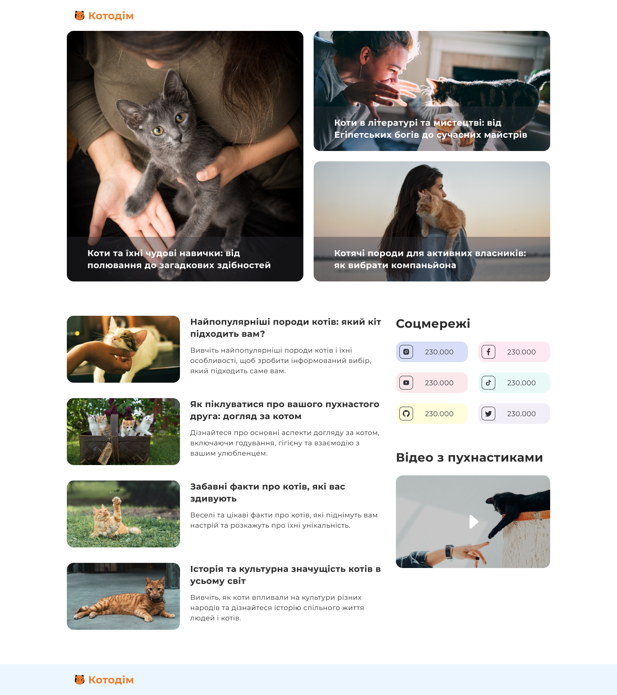

# Cathouse 🐾

A minimalist landing page crafted with HTML and CSS, developed to practice responsive layout design using CSS Grid. The project demonstrates how to structure and align content effectively across screen sizes, without relying on JavaScript or interactive UI features.

🌐 **Live Demo:** [https://aburianenko.github.io/Cathouse/](https://aburianenko.github.io/Cathouse/)  
📁 **Source Code:** [https://github.com/ABurianenko/Cathouse](https://github.com/ABurianenko/Cathouse)

---

## ✨ Features

- 🎨 Stylish and modern landing page layout
- 📱 Fully responsive design for mobile, tablet, and desktop
- 🚀 Smooth scrolling and simple animations

## 🛠️ Built With

- HTML5
- CSS3

## 📸 Preview



## 🧰 How to Use

To view the page locally:

```
git clone https://github.com/ABurianenko/Cathouse.git
cd Cathouse
open index.html
```

## 📄 License

This project is open source and available under the MIT License.

Made with ❤️ by ABurianenko
